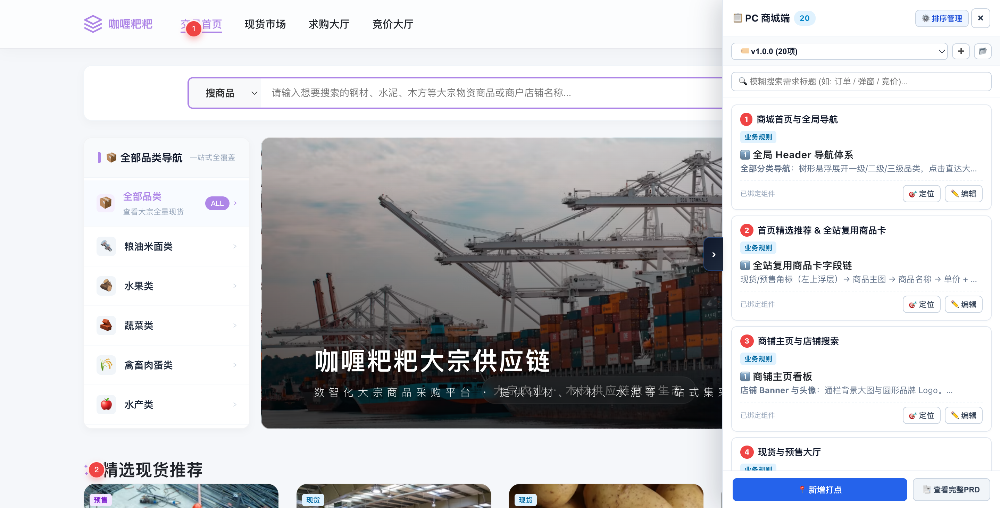
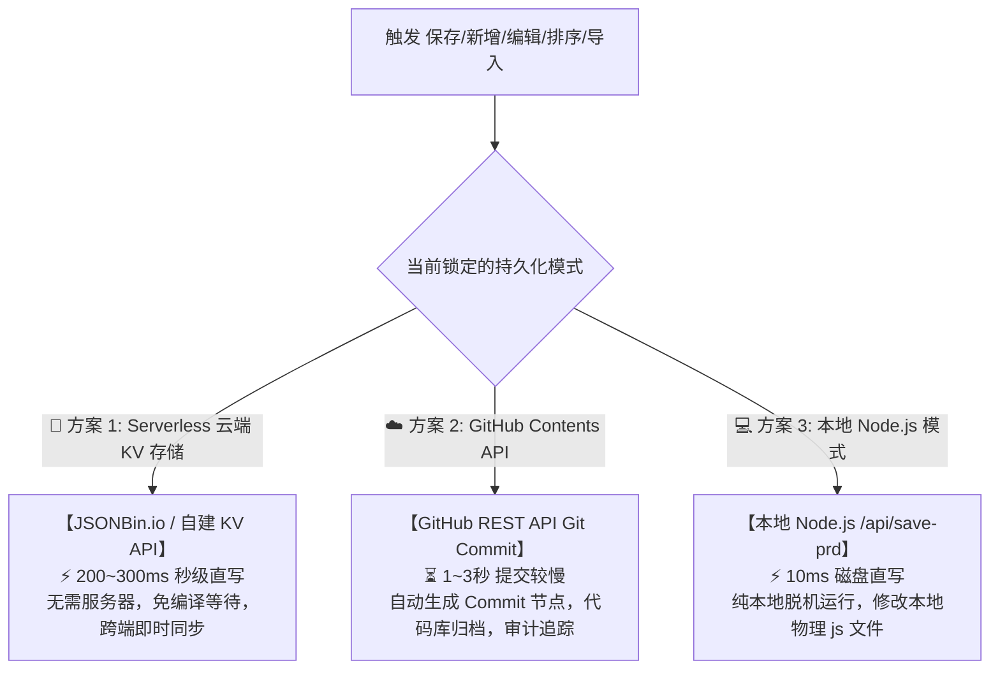

# 📌 PM Prototype PRD Pinning & Multi-Version Specification Engine

<div align="center">

**The Ultimate Interactive PRD Pinning, Vditor IR Markdown Editor & Tri-Engine Persistence System for HTML Prototypes.**

[](https://github.com/barry0-0/pm-proto-prd-pin/releases/tag/1.2.0)
[](https://opensource.org/licenses/MIT)
[](#-internationalization-i18n)
[](#-quick-start)

[English](#-english-documentation) • [简体中文](#-简体中文文档) • [日本語](#-日本語ドキュメント) • [한국어](#-한국어-문서)

</div>

---

## 📸 Interface Screenshots

| ✍️ Vditor IR Live Editor & Visual Tables | 🗂️ 3-State Drawer (Full / Semi Rail / Hidden) |
| :---: | :---: |
|  |  |
| **🔄 Pure-White Mermaid Statecharts** | **📑 Full Page Deliverable PRD Screen** |
|  |  |

---

# 🌐 English Documentation

## ⚛️ Cross-Framework Compatibility (HTML / Vue / React) & Autonomous Detection

- **Autonomous Tech-Stack Inspection**: Automatically analyzes `package.json`, Vite/Webpack configs, or HTML structure to detect if the project is **Pure HTML**, **Vue.js (2/3/Nuxt)**, or **React (18/Next.js)**.
- **Interactive Clarification Fallback**: If the framework cannot be determined automatically, the agent will prompt the user to confirm the framework and target pages/modules.
- **SPA Client-Side Route Sync**: Intercepts `history.pushState` / `popstate` to automatically adapt pins across SPA route transitions without page refreshes.
- **Virtual DOM Dynamic Re-anchoring**: Automatically re-attaches pins when conditional components (`v-if` / React modals) enter or exit the DOM.
- **Scoped CSS & Hash Filtration**: Automatically filters Vue `data-v-xxxx` and React CSS-in-JS hashes to guarantee robust long-term selector anchoring.
- **Tailwind CSS Reset Isolation & SPA Resource Hydration**: Full CSS isolation sandbox protecting Vditor toolbar icons from Tailwind Preflight distortion, with ISO-8859-1 safe header sanitization for non-ASCII SPA routes.

---

## 🌟 Tri-Engine Persistence System & Comparison

| Persistence Mode | Underlying Architecture | Read/Write Latency | Use Cases & Key Characteristics |
| :--- | :--- | :--- | :--- |
| **🔑 Mode 1: Serverless Cloud KV Storage (JSONBin.io / Custom KV) —— [Recommended / Fastest]** | RESTful KV API (`GET /latest` Public Read, `PUT` Private Write with Master Key) | **Instant (200~300ms)**<br>Zero build wait, instant cross-browser hydration | **Best for Online Staging**: Zero-server deployment (GitHub Pages, Vercel). Instant synchronization across devices without waiting for Git pipelines. |
| **☁️ Mode 2: GitHub Contents API Git Commit** | GitHub REST API (`PUT /contents/{filePath}` Base64 encoded Git Commits) | **Slower (1~3s)**<br>Git tree hashing, commit chaining, and Pages rebuild delay | **Best for Strict Audit Trails**: Automatically generates formal Git commits. **Trade-off: Slower push latency and delayed build updates on GitHub Pages**. |
| **💻 Mode 3: Local Node.js Disk Storage** | Native Node.js server (`POST /api/save-prd` writing directly to disk via fs) | **Sub-millisecond (10~50ms)**<br>Direct local filesystem I/O | **Best for Offline Development**: Pure offline local development with zero external network dependency. |

---

## 🔄 1-Click Seamless Data Migration Across Modes

When switching between persistence engines (e.g. from Local Node to Cloud JSONBin or GitHub):
- **🚀 Migrate & Sync Current Data (Recommended)**: Automatically writes all in-memory pins and versions into the newly selected backend, ensuring zero-break transition.
- **📥 Clean Switch (Pull from New Source)**: Switches configuration only and pulls the latest data directly from the new target storage.
- **💾 Local Backup Safety**: Includes a 1-click `💾 Download Local Backup (.json)` button for absolute data safety.

---

## 🔒 Creator Authentication & Read-Write Segregation

To prevent unauthorized tampering on public or hosted prototypes:
- **👁️ Visitor Read-Only Protection**: Anyone opening the prototype gets instant read access to all pins, rich Markdown specs, Mermaid diagrams, and PDF exports without any login friction.
- **🔒 Mandatory Creator Auth (100% Interception Matrix)**:
  - 📍 Adding New Pins (`setPRDMode('pick')`)
  - ✏️ Editing Specification Clauses (`openEditorForPin(id)`)
  - 🗑️ Deleting Pins (`deletePin(id)`)
  - 📂 Importing PRD Data (`handlePRDImportFile()`)
  - 🔀 Creating Versions (`createPRDVersion(ver)`)
  - 🗑️ Deleting Versions (`deletePRDVersion(ver)`)
  - ⚙️ Reordering Pins (`toggleDrawerManageMode()`)
- **Incognito & Session Isolation**: Unauthenticated sessions (incognito mode, fresh browsers) always start in read-only mode and require entering the Master Key to unlock.

---

## 🌟 Key Capabilities & Features

| Capability | Technical Implementation | PM & Engineering Benefit |
| :--- | :--- | :--- |
| **✍️ Vditor IR Markdown Workbench** | Integrated Vditor (Instant Rendering mode) with relative vendor loading + CDN auto-fallback | Typora-grade live authoring experience; instantaneous rendering for all components |
| **⌨️ Multi-Level Tab Indentation** | Native `Tab` and `Shift+Tab` event handlers for unordered/ordered/task lists | Effortlessly organize nested specifications (`1 -> 1.1 -> 1.1.1`) |
| **📊 Interactive Visual Table Editor** | 2D HTML cell matrix, direct cell typing, `Enter/Tab` navigation, 1-click row/col ops | Completely eliminates markdown pipe `\| col \|` syntax friction; feels like Excel/Word |
| **🔄 Pure-White Mermaid Vector Engine** | Dedicated white container with dynamic bottom viewBox compensation (+28px) | Zero clipped labels or distorted arrows on Statecharts, Sequences, and Flowcharts |
| **💡 3 Core Business Templates** | Fast-insert buttons for Business Rules, Statechart Diagrams, and Data Dictionary Tables | Rapid authoring of standardized specification clauses |
| **👀 Single-Entry Stash & Minimize** | Clean close `✕` in header + `👀 Stash & View Page` in bottom bar (`.prd-editor-mini-dock` pill) | Review underlying prototype elements without losing unsaved drafts; 1-click restore |
| **🌐 Native 4-Language i18n** | Full 115-key dynamic dictionary covering `en`, `zh-CN`, `ja`, `ko`; runtime hot-switching | Seamless multi-lingual team collaboration across global product workflows |
| **🗂️ 3-State Drawer & Dual Handles** | Full (400px), Semi (56px Mini Rail), Hidden (0px); dual inward-facing edge handles | Frees up 95% of prototype canvas while keeping all pins immediately accessible |
| **🔒 Reorder Safety Lock & Cascade** | Normal browsing locks order; manage mode unlocks `🔝 Top`, `🔢 Move To`, sequential cascade | Accidental reordering prevention; seamless 1 -> 2 -> 3 cascading when reordering |
| **🏷️ Multi-Version Physical Isolation** | Isolated `versionRegistry`; new versions start clean (0 pins); upload conflict resolver | No pin cross-contamination across sprint iterations |
| **📑 Full PRD Document & PDF Export** | Dedicated doc modal + new tab view with TOC outline and print styling | 1-click export to deliverable PDF or Markdown specifications |

---

# 🇨🇳 简体中文文档

## ⚛️ 跨框架兼容架构 (HTML / Vue / React) 与自主工程感知

- **🚫 SPA 工程严禁生成冗余 HTML (Zero-HTML In React/Vue)**：在 React/Vue 现代工程中，绝对禁止生成任何独立的 `.html` 页面，仅在全局入口（`main.tsx` / `main.js`）以一行 `import` 挂载，零 HTML 污染；
- **工程架构自主嗅探 (Autonomous Inspection)**：自动检查 `package.json`、Vite/Webpack 插件及文件类型，智能识别当前工程是 **HTML 静态原型**、**Vue.js (Vue 2/3/Nuxt)** 还是 **React (React 18/Next.js)**；
- **未能识别时的前置提问协议**：若无法推断框架，Agent 自动前置发起询问：确认所用技术栈及 PRD 打点需应用的页面/模块；
- **SPA 客户端路由热感知**：自动代理全局 `history.pushState` / `popstate`，Vue Router / React Router 无刷新切页时自动切换打点数据；
- **虚拟 DOM 动态挂载自愈**：结合 `MutationObserver`，在 `v-if` / 弹窗动态挂载时毫秒级自动定位并贴附大头针；
- **Scoped CSS 与随机哈希清洗**：智能剔除 `data-v-xxxx` 与 CSS-in-JS 哈希类名，优先提取语义化结构路径；
- **Tailwind CSS 样式强隔离与深层 SPA 路由安全**：构建 Vditor 专属样式沙箱，根除 Tailwind Preflight 造成的图标撕裂，并自动对中文 SPA 路由执行 ISO-8859-1 安全编码。

---

## 🌟 三模态持久化体系与云端强确认后置缓存原则

- **云端强确认后置缓存原则 (Post-Cloud Confirmation)**：严禁前置假成功写入，必须经由真实 HTTP 200 强校验后方才同步更新本地离线镜像；若云端同步失败则立即触发原子回滚并弹窗报错；
- **自包含原生 Toast 反馈引擎**：内建独立的 `#prd-global-toast-container`，杜绝依赖任何外部宿主 UI 库；
- **跨浏览器全员零配置直读**：通过代码内置的 `DEFAULT_JSONBIN_MAPPING` 绑定云端 Bin ID，任何新浏览器或访客打开页面，启动时自动秒级拉取最新打点规约，无需配置任何密钥。

- **跨浏览器全员零配置直读**：通过代码内置的 `DEFAULT_JSONBIN_MAPPING` 绑定云端 Bin ID，任何新浏览器或访客打开页面，启动时自动秒级拉取最新打点规约，无需配置任何密钥；
- **创立人权限写入与实时同步**：创立人输入 Master Key 即可直接向云端 Bin 执行秒级落盘写入。

---

## 🌟 三模态持久化体系与方案实现对比

针对产品经理在不同阶段（本地制作、团队评审、线上发布）的诉求，系统提供了三套严格排他的持久化架构：



### 1. 🔑 方案 1：Serverless 云端 KV 存储打点（JSONBin.io / 自定义 KV）—— 【强烈推荐 / 最快捷】
- **核心实现原理**：
  - 采用 RESTful KV 读写分离架构：
    - **公开只读**：`GET https://api.jsonbin.io/v3/b/{binId}/latest?_t=${Date.now()}`，访客免密秒级拉取最新规约（添加抗缓存时间戳）；
    - **私密写入**：`PUT https://api.jsonbin.io/v3/b/{binId}`，Header 携带 `X-Master-Key` 鉴权更新；
- **核心优势与快捷性**：
  - **秒级极速响应 (200~300ms)**：修改后瞬间保存生效，跨电脑、跨浏览器、移动端打开即时同步；
  - **100% 零服务器运维**：无需购买任何云主机或配置数据库，开箱即用；
  - **适用场景**：GitHub Pages 静态托管、在线演示评审、跨设备协同标注。

### 2. ☁️ 方案 2：GitHub Contents API 推送打点（Git Commit 模式）
- **核心实现原理**：
  - 使用 GitHub Fine-Grained Personal Access Token (PAT)；
  - 调用 `PUT https://api.github.com/repos/{owner}/{repo}/contents/{filePath}`，将打点数据以 Base64 编码自动生成正式 Git Commit 提交入库；
- **特性与局限性说明 (Trade-offs)**：
  - **版本审计追踪优势**：每一次修改在 GitHub 仓库中均有完整的提交者信息与版本 Diff 历史，便于合规审计；
  - **推送相对较慢 (1~3 秒)**：由于涉及 GitHub API 的 Tree 递归计算与 Commit 链打包，写入耗时相对较长；且若依赖 GitHub Pages 构建重新部署，公网生效存在几分钟流水线延迟。

### 3. 💻 方案 3：本地 Node.js 磁盘直写打点（Local Node 模式）
- **核心实现原理**：
  - 本地终端运行 `node server.js`；
  - 前端通过 `POST /api/save-prd` 调用 Node 原生 fs 模块直接改写磁盘上的物理 `prd-data-*.js` 文件；
- **适用场景**：企业内网断网开发、保密原型制作、离线纯本地开发。

---

## 🔄 模式切换与一键无缝数据迁移决策

当产品经理在配置中心切换持久化引擎时（如从本地磁盘模式切至云端 KV 模式）：
- **🚀 同步迁移当前数据到新方案（推荐）**：自动将当前已编辑的全部打点与多版本（共 N 项规约）即刻整体写入到新的持久化数据源中，实现零断点无缝过渡；
- **📥 不同步现有数据（从新数据源拉取）**：仅切换底层引擎配置，不覆盖新数据源原有内容，稍后直接从新数据源加载最新或作为独立环境；
- **🛡️ 一键本地备份安全保障**：弹窗内置一键 `💾 下载本地备份 (.json)`，确保跨模式切换 100% 零数据丢失。

---

## 🔒 读写权限分离与创立人身份强鉴权

为了防止原型发布到线上后被外部人员随意篡改，系统内建了**企业级权限隔离机制**：

1. **👁️ 访客只读保护（零干扰免密浏览）**：
   - 外部访客、设计或研发人员打开页面，直接只读加载全部打点、Markdown 规约、Mermaid 流程图与数据字典，无任何弹窗打扰；
2. **🔒 敏感操作 100% 强拦截矩阵**：
   - 在未通过 Master Key 验证的会话中，触发以下任一操作系统**立即前置阻断并弹出 `🔒 创立人身份鉴权` 模态框**：
     - 📍 **新增组件打点** (`setPRDMode('pick')`)
     - ✏️ **编辑需求规约** (`openEditorForPin(id)`)
     - 🗑️ **删除需求点** (`deletePin(id)`)
     - 📂 **导入 PRD 数据** (`handlePRDImportFile()`)
     - 🔀 **新建版本** (`createPRDVersion(ver)`)
     - 🗑️ **删除版本** (`deletePRDVersion(ver)`)
     - ⚙️ **排序管理模式** (`toggleDrawerManageMode()`)
3. **🔑 无痕模式与会话安全隔离**：
   - 取消了任何本地协议的自动免密特权；
   - 在无痕模式或新浏览器中打开，必须输入专属 Master Key 向云端完成鉴权；
   - 验证通过后写入当前浏览器的 `sessionStorage` 解锁全量工作台，关闭窗口后自动失效，杜绝密钥遗留。

---

## 🛠️ 项目工程结构与集成

```html
<!-- 在任意 HTML 原型 </body> 前引入： -->
<script src="./assets/js/prd-pin-tool.js"></script>
```

```text
my-prototype/
├── admin.html               # 原型页面 A
├── mall.html                # 原型页面 B
├── merchant.html            # 原型页面 C
├── h5.html                  # 原型页面 D
├── merchant-h5.html         # 原型页面 E
├── server.js                # 本地持久化后端服务 (Node.js 原生零依赖，提供 /api/save-prd)
├── start.sh                 # 一键启动脚本
└── assets/
    ├── vendor/
    │   └── vditor/          # Vditor 离线资源
    └── js/
        ├── prd-pin-tool.js  # 核心引擎 (V6 Vditor/Tab缩进/三态抽屉/三模态持久化/多语言)
        ├── prd-data-admin.js
        ├── prd-data-mall.js
        └── prd-data-merchant.js
```

---

# 🇯🇵 日本語ドキュメント

## 🌟 3 つの永続化モードとアーキテクチャ比較

1. **🔑 モード 1: Serverless クラウド KV ストレージ (JSONBin.io) —— 【推奨・最速】**：
   - RESTful API による高速リアルタイム同期（200〜300ms）。Git のプッシュ待ちやビルド待ちなし。クロスデバイス共同作業に最適。
2. **☁️ モード 2: GitHub Contents API プッシュモード (Git Commit)**：
   - GitHub REST API を介して正式な Git Commit を自動作成。監査ログに優れるが、**Git のプッシュ処理と Pages 再ビルドのため反映に時間がかかる**特性があります。
3. **💻 モード 3: ローカル Node.js ディスク直接保存**：
   - ローカルの `node server.js` を介してローカルディスクの `.js` ファイルを直接更新。オフライン開発に最適。

## 🔒 閲覧・編集の権限分離とマスターキー認証
- **閲覧者モード（デフォルト）**：認証なしでピン、Markdown 仕様書、Mermaid 図、PDF エクスポートを自由に閲覧可能。
- **作成者認証ガード**：ピン追加、仕様編集、削除、インポート、バージョン作成時にマスターキー認証モーダルを強制表示。

---

# 🇰🇷 한국어 문서

## 🌟 3가지 영속성 모드 및 아키텍처 비교

1. **🔑 모드 1: Serverless 클라우드 KV 스토리지 (JSONBin.io) —— 【강력 추천 / 초고속】**：
   - RESTful API 기반 초고속 실시간 동기화 (200~300ms). Git 푸시 대기 시간 없음. 서버리스 정적 배포 환경에 최적.
2. **☁️ 모드 2: GitHub Contents API 푸시 모드 (Git Commit)**：
   - GitHub REST API를 통해 정식 Git Commit을 자동 생성. 이력 추적에 유리하지만 **푸시 처리 및 Pages 재빌드로 인해 상대적으로 느림**.
3. **💻 모드 3: 로컬 Node.js 디스크 직접 저장**：
   - `node server.js`를 통해 로컬 디스크의 `.js` 파일을 직접 수정. 오프라인 개발에 최적.

## 🔒 읽기/쓰기 권한 분리 및 마스터 키 인증
- **방문자 읽기 전용 (기본)**：인증 없이 핀, 마크다운 명세, Mermaid 다이어그램을 자유롭게 열람.
- **작성자 인증 가드**：핀 추가, 명세 편집, 삭제, 가져오기, 버전 생성 시 마스터 키 인증 모달 강제 팝업.

---

## 📄 License
MIT License. Created for Product Managers & UI/UX Engineers.
